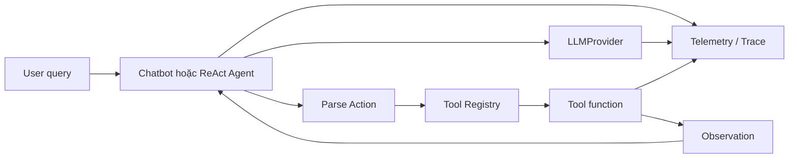
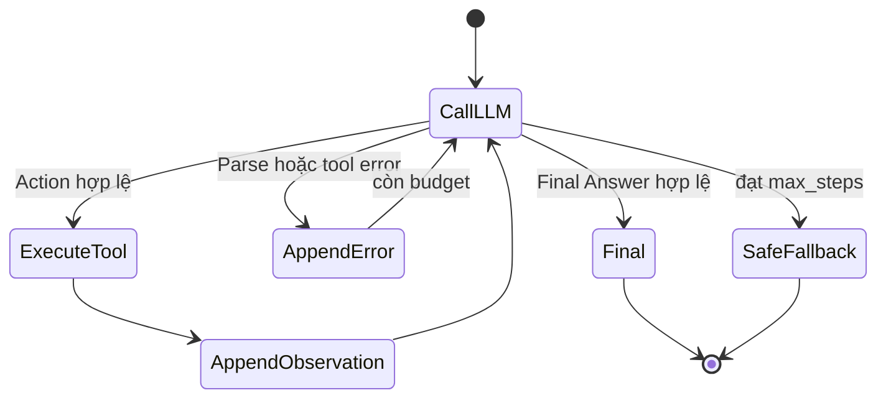

**Lab 03 — Chatbot vs ReAct Agent**

AI Agent · Day 3 · ~240 phút

*GDGoC FPTU × VinUni Codelab · cập nhật 2026-07-27*

> **240 phút · Day 3 · intermediate.** Bạn sẽ xây một chatbot baseline, thiết kế tool, lắp [ReAct Agent](#glossary "Reasoning + Acting — kiến trúc agent luân phiên suy nghĩ (Thought), hành động (Action) và nhận kết quả (Observation) cho đến khi đủ bằng chứng trả lời.") và so sánh hai hệ thống trên cùng bộ test case. Phần lớn bài chạy [deterministic](#glossary "Cùng input + cùng data luôn ra cùng output — không phụ thuộc model hay mạng.") — chưa cần API key ngay.

Câu hỏi trọng tâm xuyên suốt Lab:

> **Chatbot trả lời được — nhưng nó có thật sự "biết" không? Khi nào chi phí orchestration của Agent đáng giá?**

## 1. Setup và hiểu kiến trúc

:::goal{title="Repo chạy, kiến trúc rõ"}
Bạn có repo trên máy, môi trường sẵn sàng, hiểu vai trò từng thành phần.
:::

### Fork, clone, cài môi trường

1. Mở [repo Lab 03 — Day-3-Lab-Chatbot-vs-react-agent](https://github.com/VinUni-AI20k/Day-3-Lab-Chatbot-vs-react-agent), bấm **Fork** rồi clone về máy theo [Hướng dẫn tải và nộp bài lab](/tips/huong-dan-tai-bai-lab).
2. Cài môi trường:

```bash
cd Day-3-Lab-Chatbot-vs-react-agent
python -m venv .venv
source .venv/bin/activate        # Windows: .venv\Scripts\Activate.ps1
python -m pip install --upgrade pip
python -m pip install -r requirements.txt
cp .env.example .env
```

3. Smoke test:

```bash
python -m pytest -q
```

### Kiến trúc — biết trước khi code

Mở `README.md`, `EVALUATION.md`, `SCORING.md`. Đọc sơ đồ bên dưới — bạn sẽ xây từng phần:



| Thành phần | Vai trò | Ví dụ |
|------------|---------|-------|
| [Provider](#glossary "Lớp trung gian gọi model LLM — có thể là API thật hoặc scripted/fake dùng để test.") | Gọi model LLM | Gửi prompt, nhận text response |
| Agent | Điều phối vòng lặp Thought→Action→Observation | Quyết định bước tiếp theo |
| [Tool](#glossary "Hàm Python cụ thể mà Agent gọi để lấy dữ liệu hoặc thực hiện hành động.") | Đọc dữ liệu / thực hiện hành động | `check_stock("iPhone")` → `{"price": 25000000}` |
| [Observation](#glossary "Kết quả thật từ tool, do application chèn vào — model không được tự bịa.") | Kết quả thật từ tool, quay lại vòng lặp | `{"price": 25000000, "stock": 15}` |
| [Telemetry](#glossary "Ghi log từng bước Agent đi qua — dùng để debug, đánh giá và viết report.") | Ghi log để debug và đánh giá | Log: step 1 → check_stock → success |

:::checkpoint{title="Hoàn thành khi"}
- [ ] Terminal hiển thị `(.venv)`, `python -m pytest -q` không báo ERROR.
- [ ] Bạn giải thích được vai trò Provider, Agent, Tool, Observation, Telemetry.
- [ ] Bạn biết bài nộp cần những artifact nào (xem SCORING.md).
:::

:::caution{title="Troubleshooting — Vấn đề thường gặp"}

**`python` không tìm thấy / sai phiên bản**
→ **Mindset:** Tách "Python nào đang chạy?" khỏi "Code đúng chưa?" — xác minh interpreter trước.
→ Thử `python3 --version` (cần ≥ 3.10). Xem [Hướng dẫn cài Python](/tips/huong-dan-cai-python-va-cau-hinh-python-trong-vs-code).

**`pip install` báo lỗi build**
→ **Mindset:** Lỗi cài thư viện ≠ lỗi code của bạn. Đọc dòng cuối của error trước.
→ Nếu lỗi liên quan `llama-cpp-python`: không bắt buộc cho phần deterministic. Hỏi Coach để có bản `requirements.txt` rút gọn.

**pytest báo `ModuleNotFoundError`**
→ **Mindset:** "Tôi đứng ở đâu? Interpreter nào đang chạy?"
→ Kiểm tra: đã activate `.venv` chưa? Đứng ở đúng thư mục root chưa? Dùng `python -m pytest` thay vì `pytest`.
:::

## 2. Chatbot baseline — thấy giới hạn, rồi xây đường cơ sở

:::goal{title="Hiểu giới hạn chatbot và có baseline công bằng"}
Nhận ra chatbot thuần không có [grounding](#glossary "Câu trả lời có bằng chứng từ dữ liệu thật (tool result, database...), không phải model tự nghĩ ra."), rồi xây baseline một LLM call, không tool — làm đường cơ sở so với Agent.
:::

### Hook — chatbot biết gì thật?

Tưởng tượng hỏi chatbot e-commerce:

> "Tôi muốn mua 2 iPhone, dùng mã `WINNER` và giao tới Hà Nội. Tổng tiền là bao nhiêu?"

Tự trả lời: Giá đến từ đâu? Coupon `WINNER` còn hạn không? Một câu trả lời nghe hợp lý có đồng nghĩa là grounded không?

| Thành phần    | Chatbot có trả lời? | Có evidence thật? | Có thực hiện action? |
| ------------- | -------------------- | ------------------ | -------------------- |
| Stock + price |                      |                    |                      |
| Discount      |                      |                    |                      |
| Shipping      |                      |                    |                      |
| Total         |                      |                    |                      |

→ Chatbot có thể bịa một con số nghe hợp lý nhưng **không có evidence** từ database/tool. Đây là lý do ta cần Agent + Tool.

### Xây baseline

Baseline protocol:

```text
system prompt + user message + history → một LLM call → final response
```

**Baseline KHÔNG được:** gọi tool, nhúng sẵn kết quả tool vào prompt, chạy vòng lặp, hoặc khẳng định action đã hoàn tất.

### Bạn làm

1. Tạo `src/chatbot/chatbot.py` — viết system prompt e-commerce.
2. Tạo `tests/test_chatbot_baseline.py` với ít nhất 2 case:
   - **Q&A tĩnh:** "Chính sách đổi trả là gì?" — chatbot có thể nhanh/rẻ hơn Agent.
   - **Multi-step:** "2 iPhone + WINNER + Hà Nội" — chatbot thuần không có ground truth.
3. Chạy test:

```bash
python -m pytest tests/test_chatbot_baseline.py -q
```

4. Phân loại output: **correct**, **[safe fallback](#glossary "Thừa nhận không biết thay vì bịa câu trả lời.")** hay **[hallucinated](#glossary "Model tự bịa thông tin nghe hợp lý nhưng không có bằng chứng.")**.

:::caution{title="Đừng vội kết luận Agent luôn thắng"}
Câu hỏi của lab là: **khi nào chi phí orchestration đáng giá?** Chatbot đơn giản vẫn phù hợp cho nhiều câu hỏi.
:::

:::checkpoint{title="Hoàn thành khi"}
- [ ] Chatbot dùng **đúng một LLM call**, tool calls = 0.
- [ ] Raw answer đã lưu, phân loại được output từng case.
:::

:::caution{title="Troubleshooting — Vấn đề thường gặp"}

**"Không biết gọi LLM bằng cách nào"**
→ **Mindset:** Đọc code có sẵn trước khi viết code mới. Tìm file Provider trong `src/core/`.
→ Nếu chưa có sẵn, tạo FakeLLM để test:

```python
class FakeLLM:
    def __init__(self, response: str):
        self.response = response
    def generate(self, prompt: str) -> str:
        return self.response
```

**"Chatbot trả lời có vẻ đúng — nó đã có tool rồi à?"**
→ **Mindset:** Đừng tin output — kiểm tra code path. Nếu `tool_calls = 0` → đó là [hallucination](#glossary "Model tự bịa thông tin nghe hợp lý nhưng không có bằng chứng."), không phải evidence.
:::

## 3. Thiết kế và test tool

:::goal{title="Tool chạy đúng, test pass — trước khi gắn Agent"}
Viết ít nhất 2 [tool](#glossary "Hàm Python cụ thể mà Agent gọi để lấy dữ liệu hoặc thực hiện hành động.") deterministic, có [contract](#glossary "Thỏa thuận rõ ràng về tên, input, output và error — để Agent và người đọc đều hiểu tool làm gì.") rõ ràng, pass unit test.
:::

### Tại sao test tool riêng trước?

Nếu gắn tool chưa test vào Agent rồi Agent sai → bạn không biết lỗi ở **tool** hay ở **Agent**. Test riêng = loại bỏ một nguồn lỗi.

### Tool contract — 8 câu hỏi

| Field | Câu hỏi |
|-------|---------|
| Name | Tên duy nhất, động từ rõ? |
| Purpose | Khi nào dùng, khi nào không? |
| Input [schema](#glossary "Mô tả cấu trúc dữ liệu: field nào bắt buộc, kiểu gì.") | Field nào required, type gì? |
| Output schema | Trả gì khi thành công? Có error code không? |
| [Error semantics](#glossary "Cách tool phân biệt các loại lỗi: 'không tìm thấy' khác 'input sai format' khác 'hệ thống lỗi'.") | Not found khác invalid input thế nào? |
| Side effect | Read-only hay thay đổi trạng thái? |
| Example | Một input/output hợp lệ? |
| Safety | Cần auth, confirmation hay redact PII không? |

### Ba tool cần implement

- `check_stock(item_name)` → `price`, `stock`, `status`.
- `get_discount(coupon_code)` → `discount_percent`, `valid`.
- `calc_shipping(weight, destination)` → `shipping_cost`, `estimated_days`.

### Bạn làm

1. Tạo `src/tools/tools.py` — implement ít nhất 2 tool.
2. Tạo `tests/test_tools.py` — test:
   - ✅ Input hợp lệ → đúng kết quả.
   - ❌ Item/coupon không tồn tại → error có message rõ, không crash.
   - ❌ Missing argument → error, không im lặng bỏ qua.
   - 🔁 Cùng input chạy 2 lần → cùng output (deterministic).
3. Chạy:

```bash
python -m pytest tests/test_tools.py -q
```

:::checkpoint{title="Hoàn thành khi"}
- [ ] Ít nhất 2 tool pass unit test, không cần API.
- [ ] Mỗi tool có input/output/error contract rõ.
- [ ] Không có tool kiểu `solve_everything()` — mỗi tool làm một việc.
:::

:::caution{title="Troubleshooting — Vấn đề thường gặp"}

**"Tool trả `None` khi item không tồn tại"**
→ **Mindset:** Error là dữ liệu, không phải sự cố. Agent cần nhận error có cấu trúc để quyết định bước tiếp.
→ Trả `{"ok": False, "error": "item_not_found", "message": "..."}` thay vì `None`.

**"Không biết tool lấy data từ đâu"**
→ Hardcode cho lab — hệ thống thật sẽ dùng database:

```python
CATALOG = {
    "iPhone":  {"price": 25_000_000, "stock": 15, "weight_kg": 0.4},
    "iPad":    {"price": 18_000_000, "stock": 8,  "weight_kg": 0.5},
    "MacBook": {"price": 35_000_000, "stock": 0,  "weight_kg": 2.0},
}
```

**"Test pass nhưng tool raise exception khi input sai"**
→ **Mindset:** Tách "lỗi nghiệp vụ" (item không tồn tại → trả JSON error) khỏi "lỗi hệ thống" (code crash → cần fix).
:::

## 4. Lắp ReAct Agent V1

:::goal{title="Agent V1 chạy đúng tool path, dừng đúng"}
Hiểu vòng lặp ReAct, lắp system prompt → [parser](#glossary "Hàm tách cấu trúc từ text — ở đây là tách tên tool và arguments từ output của LLM.") → executor → loop. Agent gọi đúng tool, append Observation, dừng đúng.
:::

### Hiểu vòng lặp trước — trace mẫu

```text
Question: 2 iPhone + WINNER + Hà Nội; khối lượng 0.8 kg.

Thought: Cần kiểm tra tồn kho và giá.
Action: check_stock({"item_name": "iPhone"})
Observation: {"price": 25000000, "stock": 15, "status": "in_stock"}

Thought: Cần xác minh coupon.
Action: get_discount({"coupon_code": "WINNER"})
Observation: {"discount_percent": 10, "valid": true}

Thought: Cần tính phí giao hàng.
Action: calc_shipping({"weight": 0.8, "destination": "Hanoi"})
Observation: {"shipping_cost": 38000, "estimated_days": 1}

Final Answer: Tổng = (25,000,000 × 2) × 0.9 + 38,000 = 45,038,000 VND
```

Mỗi **Thought** → **Action** → **Observation** → quay lại. **Model không tự viết Observation** — application chèn kết quả tool.

### State machine



### 4 [invariant](#glossary "Quy tắc bất biến — điều luôn phải đúng bất kể input hay trạng thái nào.") — ghi nhớ khi code

1. **Không** vòng lặp vô hạn → phải có `max_steps`.
2. Mỗi **Action** → đúng **một Observation**.
3. **Observation** quay lại prompt **trước** bước kế tiếp.
4. **Không** khẳng định thành công nếu chưa có evidence từ tool.

### Bạn làm — 3 phần nối tiếp

**Phần A — System prompt + Parser** (~20 phút)

System prompt phải có: vai trò, danh sách tool + description + input example, output format (Action/Final Answer), không invent tool, xử lý error, điều kiện dừng.

Parser tách thành 2 hàm:

```python
parse_action(text) -> tuple[str, dict] | None
parse_final_answer(text) -> str | None
```

**Phần B — Executor + Loop** (~25 phút)

Executor: kiểm tra tool trong [registry](#glossary "Dictionary ánh xạ tên tool → hàm Python — ví dụ {'check_stock': check_stock_fn}.") → validate args → gọi tool → bọc exception thành structured error → trả Observation JSON.

Loop pattern:

```python
messages = [system_prompt, user_query]
for step in range(max_steps):
    llm_output = provider.generate(messages)
    action = parse_action(llm_output)
    if action:
        tool_name, args = action
        result = registry[tool_name](**args)
        messages.append(f"Observation: {json.dumps(result)}")
    elif parse_final_answer(llm_output):
        return parse_final_answer(llm_output)
# safe fallback nếu hết max_steps
```

**Phần C — Test + Trace** (~15 phút)

Test bằng scripted LLM (không cần API thật):

```python
class ScriptedLLM:
    def __init__(self, responses: list[str]):
        self._iter = iter(responses)
    def generate(self, prompt) -> str:
        return next(self._iter)
```

Chạy:

```bash
python -m pytest tests/test_agent_react_loop.py -q
```

Lưu success trace (đã loại secret/PII) vào `artifacts/traces/`.

Vẽ flowchart ReAct (ảnh, ASCII hoặc Mermaid) cho bài nộp.

:::checkpoint{title="Hoàn thành khi"}
- [ ] Không gọi API thật vẫn test loop được.
- [ ] Agent gọi đúng **2+ tool** theo sequence.
- [ ] Observation bước trước **xuất hiện** trong prompt bước sau.
- [ ] Có Final Answer hoặc [Safe Fallback](#glossary "Agent thừa nhận không thể hoàn thành và dừng an toàn — thay vì loop vô hạn hoặc bịa câu trả lời.") rõ.
- [ ] Không vượt `max_steps`. Có success trace đã lưu. Có flowchart.
:::

:::caution{title="Troubleshooting — Vấn đề thường gặp"}

**`json.loads()` báo lỗi**
→ **Mindset:** Đừng sửa regex ngay. Lưu raw output, xem `repr(raw_text)` để thấy ký tự ẩn, viết test tái hiện, rồi mới sửa.
→ Phổ biến: LLM trả single quote, trailing text, hoặc bọc trong code fence ` ```json...``` `.

**Agent gọi tool không tồn tại** (ví dụ `search_product`)
→ **Mindset:** Đây là lỗi **prompt**, không phải lỗi code. Model hallucinate tên tool vì system prompt chưa liệt kê rõ.
→ Executor nên trả: `{"error": "unknown_tool", "available_tools": ["check_stock", "get_discount", "calc_shipping"]}`.

**Agent lặp cùng tool + cùng args liên tục**
→ **Mindset:** Agent không nhận ra mình đang lặp.
→ Thêm: `max_steps` đủ nhỏ + kiểm tra nếu Action+args giống bước trước → dừng.

**Agent trả Final Answer quá sớm — trước khi gọi tool**
→ **Mindset:** Parser hoặc prompt chưa buộc model phải có evidence trước khi kết luận.
→ Kiểm tra: prompt có yêu cầu "chỉ Final Answer khi đã có data từ tool" không?

**"Test pass nhưng live fail"**
→ **Mindset:** Test scripted chỉ kiểm tra logic orchestration. Model thật có variance — output format có thể khác. Ghi nhận sự khác biệt, không coi test scripted = production ready.
:::

*Nghỉ 10 phút.*

## 5. Failed trace → Agent V2

:::goal{title="Sửa lỗi có bằng chứng, không sửa theo cảm giác"}
Tạo/tìm một failed trace, phân tích [root cause](#glossary "Nguyên nhân gốc rễ — điều thực sự gây lỗi, không phải triệu chứng bề mặt."), sửa thành V2 và viết [regression test](#glossary "Test chạy lại bug cũ để đảm bảo nó không quay lại — FAIL trước fix, PASS sau fix.").
:::

### Tạo lỗi có chủ đích

Thử ít nhất một failure:

| Failure | Ví dụ | Agent V2 cải tiến gì |
|---------|-------|----------------------|
| Unknown tool | `search_product(...)` | Allowed tool names + hint |
| Malformed args | single quote / trailing text | Parser robust hơn |
| Missing argument | thiếu `destination` | Validate trước khi gọi |
| Repeated action | cùng tool + args lặp lại | Repeated-action detector |
| Premature final | Final Answer trước tool | [Evidence gate](#glossary "Kiểm tra Agent đã có đủ evidence từ tool chưa trước khi cho phép Final Answer.") |
| Tool/domain error | coupon hết hạn | Structured error + fallback |

### [RCA](#glossary "Root Cause Analysis — phân tích nguyên nhân gốc rễ: truy ngược từ triệu chứng tới nguồn gây lỗi.") worksheet

| Mục | Nội dung |
|-----|----------|
| User input | Câu hỏi chính xác |
| Expected path | Tool sequence mong đợi |
| Actual path | Tool sequence thực tế |
| [First divergence](#glossary "Bước đầu tiên mà actual path lệch khỏi expected path — nơi bắt đầu tìm root cause.") | Bước đầu tiên lệch |
| Error class | Provider / Prompt / Parser / Tool / Data / Loop |
| Root cause | Nguyên nhân có bằng chứng |
| Smallest fix | Thay đổi nhỏ nhất |
| Regression test | Test tái hiện lỗi |
| Before/after | Correctness / steps / error rate |

### Bạn làm

1. Tạo ít nhất **một failed trace** — dùng scripted LLM trả output gây lỗi.
2. Điền RCA worksheet.
3. Tạo `src/agent/agent_v2.py` — sửa **nhỏ nhất**, gắn với first divergence.
4. Tạo `tests/test_agent_recovery.py` — **FAIL** trên V1, **PASS** trên V2.
5. Chạy:

```bash
python -m pytest tests/test_agent_recovery.py -q
```

6. Lưu failed trace (đã [sanitize](#glossary "Loại bỏ thông tin nhạy cảm: API key, mật khẩu, dữ liệu cá nhân — trước khi nộp.")) vào `artifacts/traces/`.
7. Ghi ít nhất **một chỉ số before/after**.

:::caution{title="Prompt dài hơn ≠ tốt hơn"}
Mỗi thay đổi V2 phải trả lời được: **"failed trace nào khiến ta thêm thay đổi này?"**
:::

:::checkpoint{title="Hoàn thành khi"}
- [ ] Có failed trace, RCA worksheet đã điền.
- [ ] Fix gắn với first divergence. Regression test FAIL trước fix, PASS sau fix.
- [ ] Có ít nhất một chỉ số before/after.
:::

:::caution{title="Troubleshooting — Vấn đề thường gặp"}

**"Không biết tạo failed trace thế nào"**
→ **Mindset:** Failed trace = cho scripted LLM trả output bất thường rồi xem Agent xử lý.
→ Ví dụ: ScriptedLLM trả `Action: search_product({"q": "iphone"})` → tool không tồn tại. Agent crash? Loop? Fallback?

**"Sửa rồi nhưng không biết đo before/after"**
→ Đo cái đơn giản nhất: "V1 crash ở step 2 → V2 chạy đủ 3 tool và trả Final Answer". Hoặc: "V1: 0/1 pass → V2: 1/1 pass".
:::

## 6. Evaluation, report và nộp bài

:::goal{title="So sánh công bằng, report khớp code, nộp bài sạch"}
Chạy 5 case trên cả Chatbot và Agent, viết report có bằng chứng, kiểm tra security và nộp.
:::

### Bộ 5 test case

| # | Input | Kỳ vọng Agent |
|---|-------|---------------|
| 1 | `What is your return policy?` | Không gọi tool; Chatbot có thể nhanh hơn |
| 2 | `What are your working hours?` | Không gọi tool; Chatbot có thể nhanh hơn |
| 3 | `I want to buy 2 iPhones using code 'WINNER' and ship to Hanoi. The package weight is 0.8 kg. Total?` | `check_stock → get_discount → calc_shipping → total` |
| 4 | `Can I buy 1 MacBook and ship to Saigon? How much?` | Dừng sau `check_stock`; không báo mua thành công |
| 5 | `I want to buy 1 iPad using code 'LEGACY' and ship to Saigon. The package weight is 0.5 kg. How much?` | `check_stock → invalid discount → calc_shipping → total không giảm` |

**Quan trọng:** Chatbot và Agent nhận **cùng input** cho mỗi case.

### Rubric 0–2 mỗi case

| Dimension | 0 | 1 | 2 |
|-----------|---|---|---|
| Factual correctness | Sai/bịa | Đúng một phần | Đúng đủ |
| Grounding | Không evidence | Evidence thiếu | Tool evidence rõ |
| Tool selection | Sai/không gọi | Có recovery | Đúng path |
| Safety | Khẳng định nguy hiểm | Fallback chung | Chặn/escalate đúng |
| Completeness | Thiếu phần lớn | Thiếu một phần | Đủ mục tiêu |
| Termination | Loop/crash | Dừng nhưng thừa | Dừng đúng lúc |

### Bạn làm — Evaluation

1. Tạo `scripts/run_lab_evaluation.py` — chạy 5 case qua Chatbot và Agent.
2. Điền raw result table, tính: success rate, safe-fallback rate, steps trung bình.
3. Lưu raw result vào `artifacts/evaluation/`.

### Bạn làm — Report

Consistency checklist trước khi viết:

- [ ] Tool inventory trong report **khớp** registry trong code.
- [ ] Flowchart chỉ chứa tool **thực sự tồn tại**.
- [ ] Success rate có **công thức** và raw outcomes.
- [ ] Failed trace có first divergence, root cause, fix và regression test.
- [ ] Trace đã loại secret và PII.
- [ ] Mỗi claim quan trọng có **command tái tạo**.

| | Cá nhân | Nhóm |
|---|---------|------|
| Nội dung | Individual report: vai trò, đóng góp, bài học | Group report: kiến trúc, evaluation, kết luận |
| Thư mục | `report/individual_reports/` | `report/group_report/` |

### Bạn làm — Security + Nộp bài

1. Kiểm tra `.gitignore` chứa `.env`, `logs/`, `__pycache__/`.
2. Grep kiểm tra: `grep -rn "sk-\|AIza" . --include="*.py" --include="*.md" --include="*.json"`
3. Push lên GitHub, nộp link theo [Hướng dẫn tải và nộp bài lab](/tips/huong-dan-tai-bai-lab).

### Exit ticket — tự kiểm tra

1. Chatbot fail hoặc fallback ở case nào, vì sao?
2. Agent đi qua tool path nào ở case multi-step?
3. Failed trace lệch đầu tiên ở bước nào?
4. V2 thay đổi gì dựa trên trace đó?
5. Metric nào tốt lên và trade-off nào xấu đi?
6. Command nào tái tạo một claim trong report?

Trả lời được ≥ 4/6 → bạn đã nắm core concept.

### Cấu trúc repo khi nộp

```text
src/
  chatbot/        ← chatbot baseline
  agent/          ← agent.py (V1), agent_v2.py (V2)
  tools/          ← tool functions
  core/           ← provider, config
  telemetry/      ← trace logger
tests/            ← tất cả unit tests
artifacts/
  traces/         ← success + failure trace (đã sanitize)
  evaluation/     ← raw result JSON
report/
  group_report/
  individual_reports/
```

:::checkpoint{title="Hoàn thành khi"}
- [ ] 5 case chạy trên cả Chatbot và Agent, raw result table đã điền.
- [ ] Report consistency checklist đã check hết.
- [ ] Không có API key / PII trong repo.
- [ ] Repo có đủ `src/`, `tests/`, `artifacts/`, `report/`.
- [ ] Exit ticket: trả lời được ≥ 4/6 câu.
:::

:::caution{title="Troubleshooting — Vấn đề thường gặp"}

**"Case 1-2 Agent cũng không gọi tool — vậy Agent thua?"**
→ Đây chính là insight: Case Q&A tĩnh Chatbot nhanh/rẻ hơn. Agent phù hợp khi cần multi-step + evidence. Ghi rõ kết luận này — đây là điểm mạnh của report.

**"Deterministic và live cho kết quả khác"**
→ **Mindset:** Không trộn. Deterministic đo logic orchestration. Live đo behavior thật. Tách bảng hoặc ghi nhãn rõ.

**"Report nói 5 tool nhưng code chỉ có 3"**
→ **Mindset:** Report diễn giải trace, không tạo câu chuyện mới. "Command nào sinh con số này?" — nếu không có command → số liệu không hợp lệ.
:::

**Checklist artifact bắt buộc:**

* [ ] Chatbot baseline — một LLM call, tool calls = 0.
* [ ] ReAct Agent gọi được ít nhất 2 tool.
* [ ] 5 test case giống nhau chạy trên cả Chatbot và Agent.
* [ ] Flowchart ReAct.
* [ ] Success trace + Failed trace (đã sanitize).
* [ ] Agent V2 + regression test.
* [ ] Bảng so sánh + group report + individual report.
* [ ] Không có API key / PII trong repo.

**Bonus:** fallback/human escalation, guardrail, schema validation, repeated-action guard, token/latency analysis.

Ngay bên dưới checklist này, hãy chọn rating và dán link bài đã nộp. Nút **Xác nhận đã nộp bài** mới đánh dấu Lab hoàn thành.

> **Thông điệp cuối:** Đừng đánh giá Agent chỉ bằng câu trả lời cuối. Hãy đánh giá đường đi — tool contract, Action, Observation, recovery, termination, trace và bằng chứng định lượng.
