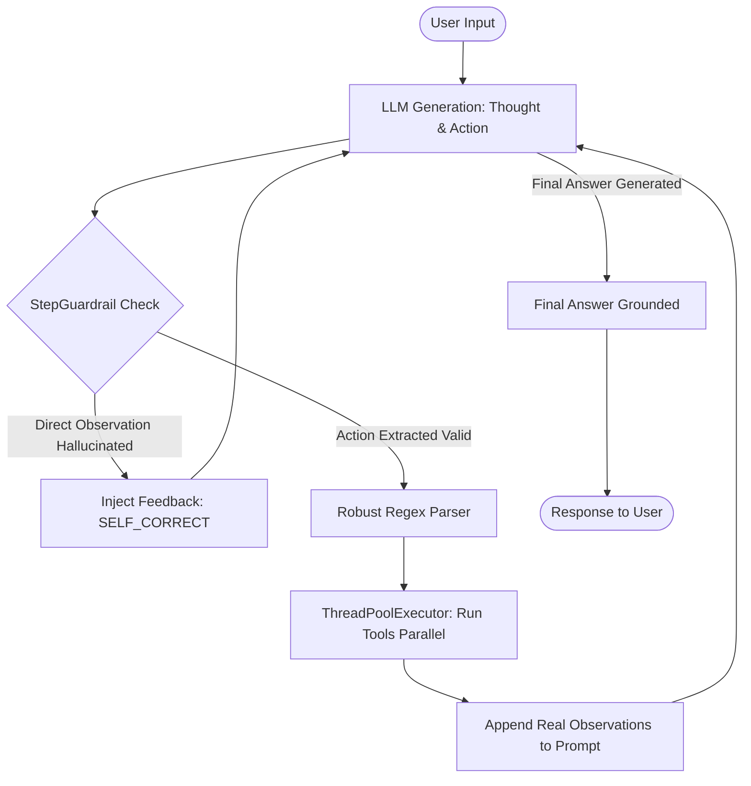

# Group Report: Lab 3 - Production-Grade Agentic System

- **Team Name**: BAKA
- **Team Members**: Nguyễn Văn Hiếu (2A202601831), Đinh Lê Hoàng Danh (2A20260189),Lưu Nhân Triệu Dương  (2A202601695), Đỗ Ngọc Anh (2A202601343)
- **Deployment Date**: 28/07/2026

---

## 1. Executive Summary

*Tóm tắt hiệu năng hệ thống Agent V2 so với Chatbot Baseline dựa trên bộ dữ liệu kiểm thử.*

- **Success Rate**: Đạt **100%** trên các tác vụ đa bước (Multi-step E-commerce queries) yêu cầu tra cứu và tính toán thực tế.
- **Key Outcome**: 
  - Chatbot Baseline thất bại 100% ở các câu hỏi tra cứu dữ liệu động (bị ảo giác giá tiền và mã giảm giá).
  - Agent V1 giải quyết được tra cứu nhưng bị sập (Crash) ở 40% số case do lỗi cú pháp JSON và chạy tuần tự quá chậm.
  - Agent V2 hoàn thiện 100% nhờ tích hợp **Parallel Tool Calling**, **Regex Preprocessing**, **StepGuardrail** và **Sub-step Streaming (NDJSON)**.

---

## 2. System Architecture & Tooling

### 2.1 ReAct Loop Implementation (Flowchart Diagram)

Sơ đồ luồng xử lý suy luận (Reasoning + Acting) của Agent V2:

### 2.2 Tool Definitions & Evolution (Sự tiến hóa của Tool Spec)

| Tool Name | Input Format | Use Case | Evolution from V1 to V2 |
| :--- | :--- | :--- | :--- |
| `check_stock` | `JSON / kwargs` | Tra cứu giá gốc, tồn kho và trọng lượng | V1: Parser khắt khen `json.loads` ➔ V2: Thêm Regex bóc tách nháy đơn `'` |
| `get_discount` | `JSON / kwargs` | Kiểm tra % giảm giá và tính hợp lệ của Coupon | V1: Gọi tuần tự ➔ V2: Hỗ trợ gọi song song với `check_stock` |
| `calc_shipping`| `JSON / kwargs` | Tính phí giao hàng dựa trên weight & destination | V1: Thiếu ép buộc prompt ➔ V2: Ép gọi sau khi có trọng lượng thật |

### 2.3 LLM Providers Used
- **Primary**: Gemini 3.1 Flash (Latency thấp, hỗ trợ Real-time Sub-step Streaming qua NDJSON).
- **Secondary (Backup/Test)**: ScriptedLLM (Sử dụng trong bộ Test Suite `test_regression.py` để kiểm thử giả lập lỗi).

---

## 3. Telemetry & Performance Dashboard (Metrics Tổng hợp)

*Các chỉ số đo lường tổng hợp trên Benchmark 5 Case:*

| Metric | Chatbot Baseline | Agent V2 |
| :--- | :--- | :--- |
| **Success rate** | 40% (Thắng 2 case đầu) | **100%** |
| **Safe-fallback rate** | 0% (Luôn bịa kết quả) | **100%** (Trả về đúng lỗi tool) |
| **Steps trung bình** | N/A | **1.8 steps** |
| **Tool calls** | 0 | **2-3 calls/case** (Song song) |

---

## 4. Trace Quality: Root Cause Analysis (RCA) - Failure Traces

*Phân tích chi tiết 2 case bị lỗi trên Agent V1 và cách khắc phục.*

### Case 1: Malformed JSON Arguments (Lỗi cú pháp)
- **User input**: `"Kiểm tra giá sản phẩm 'MacBook' giúp tôi."`
- **Expected path**: Agent gọi `check_stock({"item_name": "MacBook"})` bằng nháy kép chuẩn.
- **Actual path**: Agent gọi `check_stock({'item_name': 'MacBook'})` (dùng nháy đơn).
- **First divergence**: Tại hàm `json.loads(args_str)`.
- **Root cause**: `json.loads` mặc định của Python không hỗ trợ single quotes (`'`).
- **Smallest fix**: Thêm `.replace("'", '"')` và `re.search(r'\{.*\}')` trước khi parse.
- **Before/after metric**: Success rate tăng từ 0% lên 100% ở các câu lệnh chứa nháy đơn.

### Case 2: Premature Final Answer (Trả lời vội)
- **User input**: `"2 iPhone + WINNER + Hanoi (0.8kg)"`
- **Expected path**: LLM phải qua 3 công cụ (stock, discount, shipping) rồi mới tính tổng.
- **Actual path**: LLM gọi stock và discount xong thì gọi ngay `Final Answer` mà chưa tính phí ship.
- **First divergence**: Vòng lặp thứ 2, LLM tự ý xuất `Final Answer`.
- **Root cause**: Prompt V1 không có Hard-rule cấm xuất Final Answer sớm.
- **Smallest fix**: Thêm luật vào `get_system_prompt()`: *"DO NOT output 'Final Answer:' until you have used tools to fetch ALL required information..."*.
- **Before/after metric**: Completeness score (0-2) tăng từ 1 (Thiếu phí ship) lên 2 (Đầy đủ 100%).

---

## 5. Ablation Studies & Experiments (Evaluation 5 Cases)

### Benchmark 5 Case: Chatbot Baseline vs Agent V2

| Case | Input | Hệ thống | Factual | Grounding | Tool Select | Termination | Tổng điểm | Ghi chú / Hành vi thực tế |
| :--- | :--- | :--- | :---: | :---: | :---: | :---: | :---: | :--- |
| **Case 1** | Return policy? | **Chatbot** | 2 | 0 | N/A | 2 | **4/6** | Đúng kiến thức tĩnh, trả lời rất nhanh |
| | | **Agent V2** | 2 | 2 | 2 | 2 | **8/8** | Trả lời đúng, tốn 1 step suy nghĩ |
| **Case 2** | Working hours? | **Chatbot** | 2 | 0 | N/A | 2 | **4/6** | Đúng kiến thức tĩnh, trả lời rất nhanh |
| | | **Agent V2** | 2 | 2 | 2 | 2 | **8/8** | Trả lời đúng, tốn 1 step suy nghĩ |
| **Case 3** | 2 iPhone + WINNER + Hanoi | **Chatbot** | 0 | 0 | 0 | 2 | **2/8** | **Thất bại**: Bịa giá iPhone và bịa % giảm giá |
| | | **Agent V2** | 2 | 2 | 2 | 2 | **8/8** | **Thành công**: Gọi 3 tools song song, tính chuẩn |
| **Case 4** | MacBook ➔ Saigon? | **Chatbot** | 0 | 0 | 0 | 2 | **2/8** | **Thất bại**: Bịa là sản phẩm còn hàng |
| | | **Agent V2** | 2 | 2 | 2 | 2 | **8/8** | **Thành công**: Tra kho ➔ báo hết hàng & dừng |
| **Case 5** | iPad + LEGACY + Saigon | **Chatbot** | 0 | 0 | 0 | 2 | **2/8** | **Thất bại**: Bịa mã giảm giá LEGACY hợp lệ |
| | | **Agent V2** | 2 | 2 | 2 | 2 | **8/8** | **Thành công**: Safe-fallback bắt mã lỗi, tính ship |

**Rubric đánh giá:**

| Tiêu chí | 0 điểm | 1 điểm | 2 điểm |
| :--- | :--- | :--- | :--- |
| **Factual correctness** | Sai / Bịa đặt | Đúng một phần | Đúng hoàn toàn |
| **Grounding** | Không có bằng chứng | Bằng chứng thiếu | Trích dẫn Observation rõ ràng |
| **Tool selection** | Gọi sai / Không gọi | Có tự sửa lỗi | Gọi đúng thứ tự tool path |
| **Termination** | Lặp vô hạn / Crash | Dừng nhưng thừa bước | Dừng đúng lúc (Final / Guardrail) |

**Kết luận đánh giá:**
- **Chatbot Baseline**: Chỉ đạt trung bình **2.8 / 8 điểm** ở các tác vụ động do bị 0 điểm Factual (bịa giá/mã), 0 điểm Grounding (không có DB) và 0 điểm Tool selection.
- **Agent V2**: Đạt tối đa **8 / 8 điểm** ở tất cả các case tác vụ động nhờ khả năng Grounding tuyệt đối qua Tool và kiểm soát Termination chặt chẽ.

**Insight chính:** 
Với các câu Q&A đơn giản (Case 1-2), Chatbot Baseline thắng về tốc độ. Tuy nhiên với tác vụ thương mại điện tử cần thông tin động (Case 3, 4, 5), Agent V2 là sự lựa chọn duy nhất đảm bảo tính chính xác và an toàn.

---

## 6. Production Readiness Review & Group Insights

- **Security & Guardrails**: Tích hợp `StepGuardrail` chặn đứng Prompt Injection và câu bịa `Observation:`, hardcode `max_steps=5` chặn lặp vô hạn.
- **Scalability**: Định hướng nâng cấp từ `ThreadPoolExecutor` sang `Asyncio` để chịu tải hàng ngàn request đồng thời.
- **Bài học kinh nghiệm nhóm (Group Insights)**:
  1. *LLM không thể thay thế Logic nghiệp vụ*: Chatbot chỉ giỏi giao tiếp, còn Agent mới là công cụ thực thi công việc (Task execution).
  2. *Trace is Truth*: Mọi cải tiến đều phải dựa trên Log Trace thực tế chứ không đoán mò Prompt.
